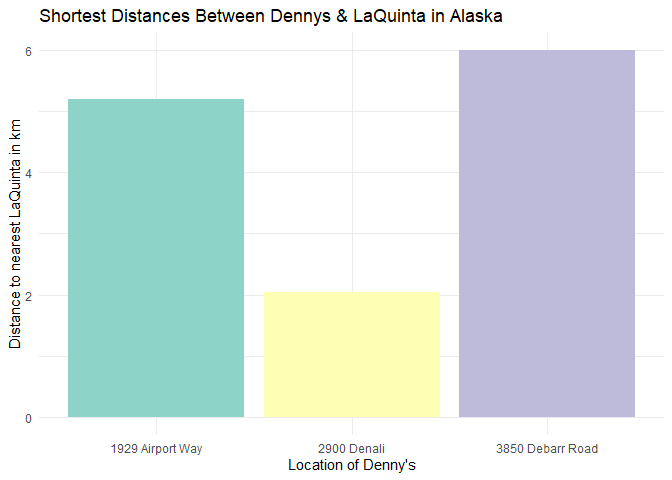
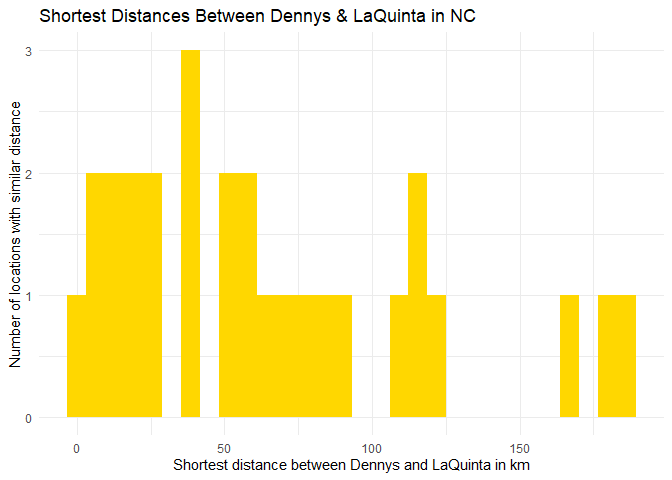
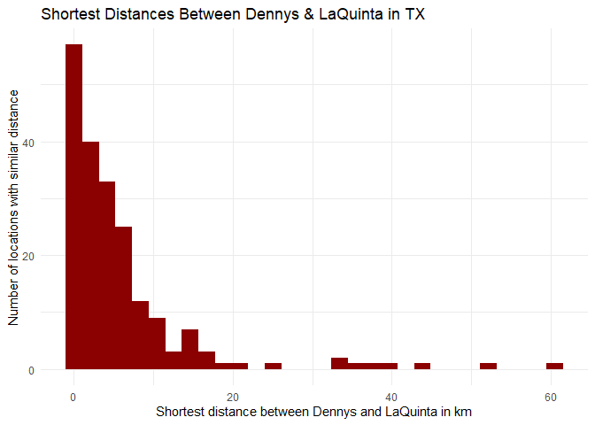
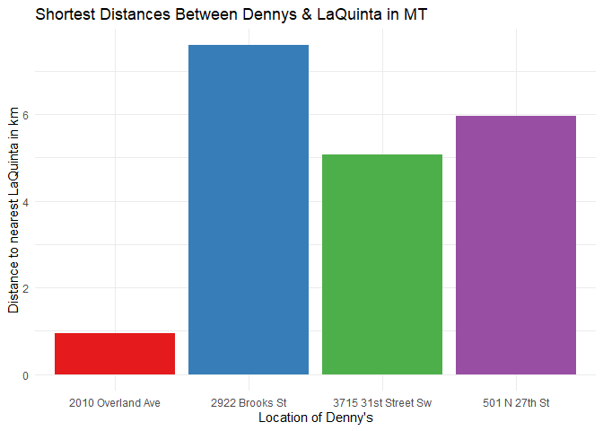

Lab 05 - Part 2
================
Jamieson Nathan
2/21/25

### Load packages and data

``` r
devtools::install_github("rstudio-education/dsbox")

library(tidyverse) 
library(dsbox) 
```

``` r
states <- read_csv("data/states.csv")
```

### 1 Filter the Denny’s data frame for Alaska (AK) and save the result as dn_ak. How many Denny’s locations are there in Alaska?

``` r
dennys_ak <- dennys %>%
  filter(state == "AK")
nrow(dennys_ak)
```

    ## [1] 3

``` r
laquinta_ak <- laquinta %>%
  filter(state == "AK")
nrow(laquinta_ak)
```

    ## [1] 2

There are 3 Denny’s and 2 Laquinta’s in Alaska.

### 2 Next we will be calculating the distance between all Denny’s and all La Quinta locations in Alaska.

``` r
comb <- nrow(laquinta_ak) * nrow(dennys_ak)
```

There are 6 combinations.

### 3 In order to calculate these distances, we need to first restructure our data to pair the Denny’s and La Quinta locations. To do so, we will join the two data frames. We have six join options in R.

``` r
dn_lq_ak <- full_join(dennys_ak, laquinta_ak, 
                      by = "state")
```

    ## Warning in full_join(dennys_ak, laquinta_ak, by = "state"): Detected an unexpected many-to-many relationship between `x` and `y`.
    ## ℹ Row 1 of `x` matches multiple rows in `y`.
    ## ℹ Row 1 of `y` matches multiple rows in `x`.
    ## ℹ If a many-to-many relationship is expected, set `relationship =
    ##   "many-to-many"` to silence this warning.

``` r
view(dn_lq_ak)
```

### 4 How many observations are in the joined dn_lq_ak data frame? What are the names of the variables in this data frame.

There are 6 rows in the frames representing a combination of dn x lq.
There are 6 columns for the respective address and coordinates of each
dn and lq, making a table of 6x12.

### 5 What function from the tidyverse do we use the add a new variable to a data frame while keeping the existing variables?

``` r
haversine <- function(long1, lat1, long2, lat2, round = 3) {
  # convert to radians
  long1 <- long1 * pi / 180
  lat1 <- lat1 * pi / 180
  long2 <- long2 * pi / 180
  lat2 <- lat2 * pi / 180

  R <- 6371 # Earth mean radius in km

  a <- sin((lat2 - lat1) / 2)^2 + cos(lat1) * cos(lat2) * sin((long2 - long1) / 2)^2
  d <- R * 2 * asin(sqrt(a))

  return(round(d, round)) # distance in km
}
```

### 6 Calculate the distances between all pairs of Denny’s and La Quinta locations and save this variable as distance. Make sure to save this variable in THE dn_lq_ak data frame, so that you can use it later.

``` r
dn_lq_ak <- dn_lq_ak %>%
  mutate(distance = haversine(longitude.x, latitude.x, longitude.y, latitude.y))

view(dn_lq_ak)
```

# 7 Calculate the minimum distance between a Denny’s and La Quinta for each Denny’s location. To do so we group by Denny’s locations and calculate a new variable that stores the information for the minimum distance.

``` r
dn_lq_ak_mindist <- dn_lq_ak %>%
  group_by(address.x) %>%
  summarize(closest = min(distance))
dn_lq_ak_mindist
```

    ## # A tibble: 3 × 2
    ##   address.x        closest
    ##   <chr>              <dbl>
    ## 1 1929 Airport Way    5.20
    ## 2 2900 Denali         2.04
    ## 3 3850 Debarr Road    6.00

# 8 Describe the distribution of the distances Denny’s and the nearest La Quinta locations in Alaska. Also include an appropriate visualization and relevant summary statistics.

``` r
dn_lq_ak_mindist %>%
  ggplot(aes(x = address.x, y = closest, fill = address.x)) +
  geom_bar(stat = "identity") +
  labs(
    title = "Shortest Distances Between Dennys & LaQuinta in Alaska",
    x = "Location of Denny's",
    y = "Distance to nearest LaQuinta in km"
  ) +
  scale_fill_brewer(palette = "Set3", guide = "none") +
  theme_minimal()
```

<!-- -->

``` r
mean(dn_lq_ak_mindist$closest)
```

    ## [1] 4.41

Yet again the joke rings true, it appears that Denny’s and LaQuinta
appear to be very closely grouped in Alaska, with and average distance
of 4.41km between them.

# 9 For NC

``` r
dennys_nc <- dennys %>%
  filter(state == "NC")
nrow(dennys_nc)
```

    ## [1] 28

``` r
laquinta_nc <- laquinta %>%
  filter(state == "NC")
nrow(laquinta_nc)
```

    ## [1] 12

There are 28 Denny’s and 12 Laquinta’s in NC

``` r
comb <- nrow(laquinta_nc) * nrow(dennys_nc)
```

There are 336 combinations.

``` r
dn_lq_nc <- full_join(dennys_nc, laquinta_nc, 
                      by = "state")
```

    ## Warning in full_join(dennys_nc, laquinta_nc, by = "state"): Detected an unexpected many-to-many relationship between `x` and `y`.
    ## ℹ Row 1 of `x` matches multiple rows in `y`.
    ## ℹ Row 1 of `y` matches multiple rows in `x`.
    ## ℹ If a many-to-many relationship is expected, set `relationship =
    ##   "many-to-many"` to silence this warning.

``` r
view(dn_lq_nc)
```

``` r
dn_lq_nc <- dn_lq_nc %>%
  mutate(distance = haversine(longitude.x, latitude.x, longitude.y, latitude.y))

view(dn_lq_nc)
```

``` r
dn_lq_nc_mindist <- dn_lq_nc %>%
  group_by(address.x) %>%
  summarize(closest = min(distance))
dn_lq_nc_mindist
```

    ## # A tibble: 28 × 2
    ##    address.x                 closest
    ##    <chr>                       <dbl>
    ##  1 1 Regent Park Boulevard     108. 
    ##  2 101 Wintergreen Dr          120. 
    ##  3 103 Sedgehill Dr             26.7
    ##  4 1043 Jimmie Kerr Road        36.1
    ##  5 1201 S College Road         188. 
    ##  6 1209 Burkemount Avenue       39.1
    ##  7 1493 Us Hwy 74-A Bypass      70.1
    ##  8 1524 Dabney Dr               59.5
    ##  9 1550 Four Seasons           115. 
    ## 10 1800 Princeton-Kenly Road    55.9
    ## # ℹ 18 more rows

``` r
dn_lq_nc_mindist %>%
  ggplot(aes(x = closest)) +
  geom_histogram(fill = "gold") +
  labs(
   title = "Shortest Distances Between Dennys & LaQuinta in NC",
   x = "Shortest distance between Dennys and LaQuinta in km",
   y = "Number of locations with similar distance") +
  theme_minimal()
```

    ## `stat_bin()` using `bins = 30`. Pick better value with `binwidth`.

<!-- -->

``` r
mean(dn_lq_nc_mindist$closest)
```

    ## [1] 65.44432

Avg distance is over 60km and much further than Alaska, showing the joke
may not hold true in NC.

# 10 For Texas

``` r
dennys_tx <- dennys %>%
  filter(state == "TX")
nrow(dennys_tx)
```

    ## [1] 200

``` r
laquinta_tx <- laquinta %>%
  filter(state == "TX")
nrow(laquinta_tx)
```

    ## [1] 237

``` r
comb <- nrow(laquinta_tx) * nrow(dennys_tx)
```

``` r
dn_lq_tx <- full_join(dennys_tx, laquinta_tx, 
                      by = "state")
```

    ## Warning in full_join(dennys_tx, laquinta_tx, by = "state"): Detected an unexpected many-to-many relationship between `x` and `y`.
    ## ℹ Row 1 of `x` matches multiple rows in `y`.
    ## ℹ Row 1 of `y` matches multiple rows in `x`.
    ## ℹ If a many-to-many relationship is expected, set `relationship =
    ##   "many-to-many"` to silence this warning.

``` r
view(dn_lq_tx)
```

``` r
dn_lq_tx <- dn_lq_tx %>%
  mutate(distance = haversine(longitude.x, latitude.x, longitude.y, latitude.y))

view(dn_lq_tx)
```

``` r
dn_lq_tx_mindist <- dn_lq_tx %>%
  group_by(address.x) %>%
  summarize(closest = min(distance))
dn_lq_tx_mindist
```

    ## # A tibble: 200 × 2
    ##    address.x             closest
    ##    <chr>                   <dbl>
    ##  1 100 Cottonwood         33.6  
    ##  2 100 E Pinehurst         1.39 
    ##  3 100 Us Highway 79 S    33.9  
    ##  4 101 N Fm 707           10.3  
    ##  5 1011 Beltway Parkway   14.0  
    ##  6 1015 Spur 350 West      1.74 
    ##  7 1015 West Main St       1.10 
    ##  8 10367 Highway 59       37.6  
    ##  9 10433 N Central Expwy   0.618
    ## 10 105 W 42nd St           6.88 
    ## # ℹ 190 more rows

``` r
dn_lq_tx_mindist %>%
  ggplot(aes(x = closest)) +
  geom_histogram(fill = "darkred") +
  labs(
   title = "Shortest Distances Between Dennys & LaQuinta in TX",
   x = "Shortest distance between Dennys and LaQuinta in km",
   y = "Number of locations with similar distance") +
  theme_minimal()
```

    ## `stat_bin()` using `bins = 30`. Pick better value with `binwidth`.

<!-- -->

``` r
mean(dn_lq_tx_mindist$closest)
```

    ## [1] 5.7918

Wow its like they are right on top of each other, avg distance of 5.8km!
Joke holds true here to the extreme.

\#11 For Montana

``` r
dennys_mt <- dennys %>%
  filter(state == "MT")
nrow(dennys_mt)
```

    ## [1] 4

``` r
laquinta_mt <- laquinta %>%
  filter(state == "MT")
nrow(laquinta_mt)
```

    ## [1] 9

``` r
comb <- nrow(laquinta_mt) * nrow(dennys_mt)
```

``` r
dn_lq_mt <- full_join(dennys_mt, laquinta_mt, 
                      by = "state")
```

    ## Warning in full_join(dennys_mt, laquinta_mt, by = "state"): Detected an unexpected many-to-many relationship between `x` and `y`.
    ## ℹ Row 1 of `x` matches multiple rows in `y`.
    ## ℹ Row 1 of `y` matches multiple rows in `x`.
    ## ℹ If a many-to-many relationship is expected, set `relationship =
    ##   "many-to-many"` to silence this warning.

``` r
view(dn_lq_mt)
```

``` r
dn_lq_mt <- dn_lq_mt %>%
  mutate(distance = haversine(longitude.x, latitude.x, longitude.y, latitude.y))

view(dn_lq_mt)
```

``` r
dn_lq_mt_mindist <- dn_lq_mt %>%
  group_by(address.x) %>%
  summarize(closest = min(distance))
dn_lq_mt_mindist
```

    ## # A tibble: 4 × 2
    ##   address.x           closest
    ##   <chr>                 <dbl>
    ## 1 2010 Overland Ave     0.955
    ## 2 2922 Brooks St        7.59 
    ## 3 3715 31st Street Sw   5.07 
    ## 4 501 N 27th St         5.95

``` r
dn_lq_mt_mindist %>%
  ggplot(aes(x = address.x, y = closest, fill = address.x)) +
  geom_bar(stat = "identity") +
  labs(
    title = "Shortest Distances Between Dennys & LaQuinta in MT",
    x = "Location of Denny's",
    y = "Distance to nearest LaQuinta in km"
  ) +
  scale_fill_brewer(palette = "Set1", guide = "none") +
  theme_minimal()
```

<!-- -->

``` r
mean(dn_lq_mt_mindist$closest)
```

    ## [1] 4.89025

I tried to beat Texas and did, these are only an avg of 4.8km away from
each other. Joke, again, holds true!

\#12

Based on my analysis, the joke seems most likely to hold true in Texas,
Montana, and Alaska, where the average distances between Denny’s and
LaQuinta locations are notably short. While the joke may resonate to
varying degrees across different regions, in this analysis, TX, MT, and
AK represent the best examples where Mitch Hedberg’s observation rings
true. This might reflect a pattern where both establishments are located
in key town centers or travel nodes, serving as convenient stops for
travelers in otherwise sparsely populated areas.
